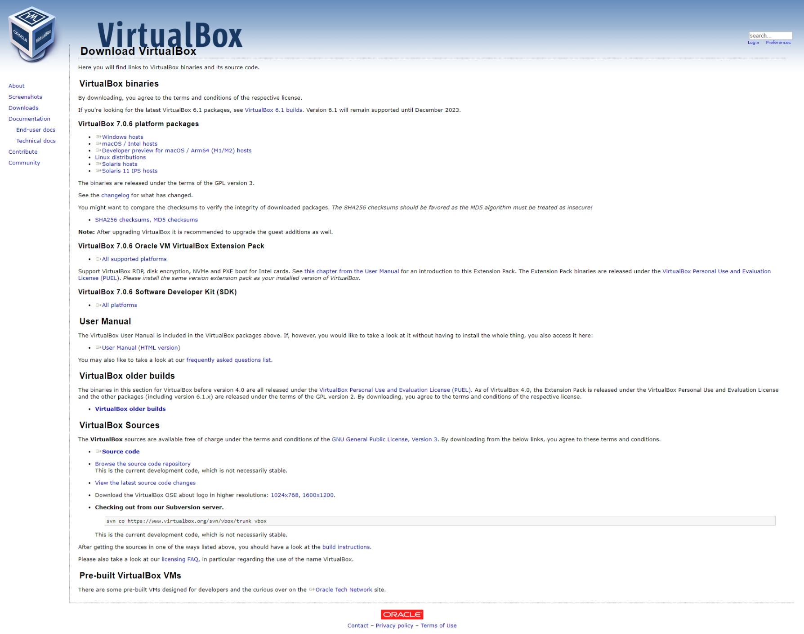
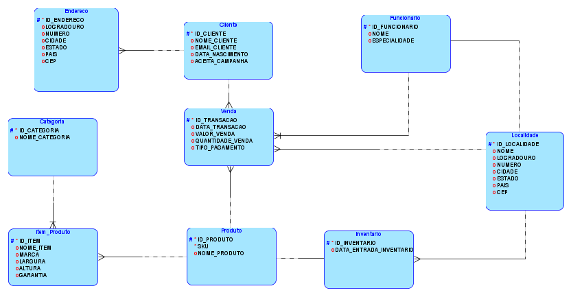
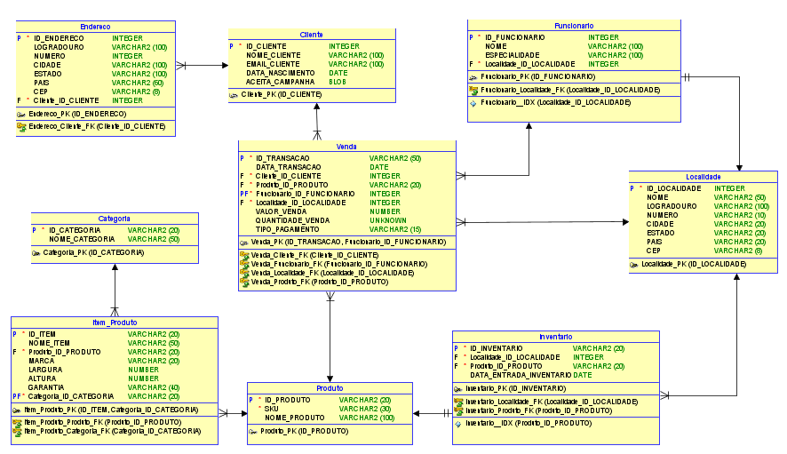
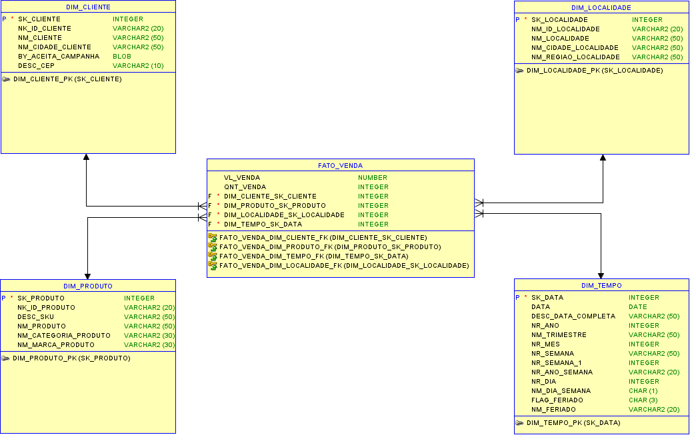

# Data Warehouse On-Premises
[](https://github.com/alexandremcastro/Data-Warehouse-Premises/blob/main/LICENSE)

<a name = "Inicio"></a>

## Sumário
+ [Introdução](#Introducao)
    + [Requisitos](#Requisitos)
    + [Sobre](#Sobre)
        + [Descrição](#Descricao)
        + [Ferramentas utilizadas](#Ferramentas)
        + [Links](#Links)
+ [Infraestrutura](#Infraestrutura)
    + [Preparando o Oracle VirtualBox](#PreparandoVirtualBox)
        + [Download](#DownloadVirtualBox)
        + [Instalação](#InstalacaoVirtualBox)
        + [Virtualização](#VirtualizacaoVirtualBox)
    + [Preparando o Oracle Linux](#PreparandoLinux)
        + [Download](#DownloadLinux)
        + [Instalação](#InstalacaoLinux)
        + [Configurações](#ConfiguracaoLinux)
            + [Arquivo Sudoers](#Sudoers)
            + [Arquivo Hosts](#Hosts)
            + [Atualização do SO](#Atualizacao)
            + [Desativando o Firewall](#Firewall)
    + [Preparando o Oracle Database](#PreparandoDatabase)
        + [Download](#DownloadDatabase)
        + [Instalação](#InstalacaoDatabase)
            + [Pre-install](#Preinstall)
            + [Instalação](#InstalacaoOracleDatabase)
            + [Criando o Listener](#Listener)
            + [Criando o Banco](#CriandoBanco)
        + [Acesso](#Acesso)
    + [Download do Oracle Data Modeler](#DownloadModeler)
    + [Download do Oracle SQL Developer](#DownloadDeveloper)
    + [Download do Pentaho Data Integration](#DownloadPDI)
+ [Modelagem](#Modelagem)
    + [Modelo negocial](#ModeloNegocial)
    + [Modelo lógico](#ModeloLogico)
        + [Como usar a ferramenta (básico)](#UsarFerramenta)
        + [Modelo](#ModeloL)
    + [Modelo relacional](#ModeloRelacional)
        + [Convertendo o modelo lógico para relacional](#ConversaoL-R)
        + [Modelo](#ModeloR)
    + [Modelo dimensional](#ModeloDimensional)
        + [Modelo](#ModeloD)
    + [Modelo físico](#ModeloFisico)
        + [Convertendo o modelo dimensional para físico](#ConversaoD-F)
        + [Modelo](#ModeloF)
+ [Sistema Legado/Staging Area](#LegadoStaging)
    + [Simulando o sistema legado](#Legado)
    + [Criando a Staging Area](#Staging)
    + [Criando as conexões com o banco](#Conexoes)
    + [Transformações](#Transformacoes)
        + [Criando a dimensão cliente](#T-D-Cliente)
        + [Criando a dimensão localidade](#T-D-Localidade)
        + [Criando a dimensão produto](#T-D-Produto)
        + [Criando o fato venda](#T-Fato)
+ [Implementação](#Implementacao)
    + [Criando o Data Warehouse](#DataWarehouse)
        + [Dimensão cliente](#DW-Cliente)
        + [Dimensão produto](#DW-Produto)
        + [Dimensão localidade](#DW-Localidade)
        + [Dimensão tempo](#DW-Tempo)
        + [Fato venda](#DW-Fato)
    + [Carga de dados](#CargaDados)
        + [Dimensão tempo](#CargaTempo)
        + [Dimensão cliente](#CargaCliente)
        + [Dimensão produto](#CargaProduto)
        + [Dimensão localidade](#CargaLocalidade)
        + [Fato venda](#FatoVendaa)
    + [Verificando a integridade de dados](#Integridade)
<br>

<a name = "Introducao"></a>
## Introdução
[Voltar para o ínicio ↑](#Inicio)

<a name = "Sobre"></a>
### Sobre

<a name = "Requisitos"></a>
<b>Requisitos</b>

- Hardware: O Oracle Database requer um hardware de servidor robusto com um mínimo de 2 GB de RAM para versões mais antigas e pelo menos 4 GB para versões mais recentes. É recomendável ter um processador multicore com, pelo menos, 4 núcleos e uma unidade de disco rígido com, no mínimo, 40 GB de espaço livre.

- Sistema operacional: O Oracle Database é executado em várias plataformas de sistema operacional, incluindo Linux, Windows, Solaris e AIX. Verifique se o sistema operacional é compatível com a versão do Oracle Database que deseja instalar.

- Software adicional: O Oracle Database requer a instalação de software adicional, como o Oracle Client, o Oracle Net Services, o Oracle Enterprise Manager e o Java Runtime Environment (JRE).

- Espaço em disco: O espaço em disco requerido para instalar o Oracle Database varia de acordo com a versão e as opções selecionadas durante a instalação. No entanto, é recomendável ter pelo menos 10 GB de espaço livre no disco rígido.

- Rede: O Oracle Database requer uma rede adequada para comunicação com outras máquinas e para acesso remoto. Verifique se a rede suporta as configurações de rede necessárias para a instalação do Oracle Database.

<br>

<a name = "Descricao"></a>
<b>Descrição</b>

Um projeto de Data Warehouse com Oracle Database é um esforço para criar um ambiente de armazenamento de dados centralizado e integrado que possa suportar as necessidades de análise de negócios de uma organização. O objetivo final é fornecer aos usuários de negócios um acesso fácil e rápido a informações precisas e relevantes para que possam tomar decisões mais informadas e eficazes.

O projeto começa com a identificação dos requisitos de negócios e dos dados que precisam ser armazenados e analisados. Em seguida, são criados modelos de dados que definem as tabelas, colunas e relacionamentos necessários para armazenar e integrar os dados. Os modelos de dados são projetados para ser escalável e permitir a adição de novos dados e análises conforme as necessidades do negócio evoluem.

Uma vez que o modelo de dados é definido, o próximo passo é a construção do data warehouse em si. O Oracle Database é uma das opções de banco de dados mais populares para Data Warehousing, devido à sua capacidade de processamento de grandes volumes de dados e à sua capacidade de escalabilidade. A arquitetura do Data Warehouse pode ser baseada em um modelo de camadas, onde os dados são carregados em uma camada de aterramento (staging layer) antes de serem transformados e carregados em camadas subsequentes. A camada final é a camada de apresentação, onde os usuários de negócios acessam os dados por meio de ferramentas de visualização ou de relatórios.

Um aspecto crítico de qualquer projeto de data warehouse é o processo de ETL (Extração, Transformação e Carregamento), que envolve a extração dos dados de várias fontes, a transformação para garantir a integridade e qualidade dos dados, e o carregamento nos repositórios de dados do data warehouse.

Por fim, o data warehouse é mantido por meio de atividades regulares de administração e manutenção, como monitoramento de desempenho, backup e recuperação de dados e gerenciamento de usuários e segurança.

Em resumo, um projeto de Data Warehouse com Oracle Database é uma iniciativa complexa que requer a definição cuidadosa de requisitos de negócios, a criação de um modelo de dados escalável, a construção de um Data Warehouse robusto e o gerenciamento contínuo do ambiente de armazenamento de dados.

<br>

<a name = "Ferramentas"></a>
<b>Ferramentas utilizadas</b>

1. [Oracle VM VirtualBox](https://www.virtualbox.org/): Fornece a virtualização de máquinas para simulação de um ambiente on-premises.
2. [Oracle Linux](https://www.oracle.com/br/linux/): Sistema operacional fornecido pela Oracle e otimizado para as suas aplicações.
3. [Oracle Data Modeler](https://www.oracle.com/br/database/sqldeveloper/technologies/sql-data-modeler/): Fornece um ambiente para criar os modelos (*lógico, dimensional e físico*).
4. [Oracle Database](https://www.oracle.com/database/): Fornece um banco de dados relacional.
5. [Oracle SQL Developer](https://www.oracle.com/database/sqldeveloper/): Fornece um ambiente para acessar o banco de dados e realizar consultas em SQL.
6. [Pentaho Data Integration](https://help.hitachivantara.com/Documentation/Pentaho/8.3/Products/Pentaho_Data_Integration): Ferramenta para realizar a integração de dados

<a name = "Links"></a>
<b>Links</b>

Link para o projeto no 
[Notion](https://alexandremcastro.notion.site/01-2023-Data-Warehouse-On-Premises-25b04fc48a6043b186b66f6cedf9a19d)  <a name = "Notion"></a>

Link para o projeto no  <a name = "Site"></a>
[Site](https://alexandre-castro.vercel.app/blog/datawarehouse-premises)

<br>

<a name = "Infraestrutura"></a>
## Infraestrutura
[Voltar para o ínicio ↑](#Inicio)

<a name = "PreparandoVirtualBox"></a>
### Preparando o Oracle VirtualBox
<br>

<a name = "DownloadVirtualBox"></a>
<b>Download</b>

Acesse a página de download do Oracle VirtualBox

[Downloads – Oracle VM VirtualBox](https://www.virtualbox.org/wiki/Downloads)



Clique na plataforma que você está utilizando, no meu caso `Windows hosts`


Automaticamente o download começará


<br>

<a name = "InstalacaoVirtualBox"></a>
<b>Instalação</b>

<aside>
💡 Instale o pacote Microsoft Visual C++ 2019 Redistributable Package (x64)

</aside>

Abra o instalador do baixado na etapa anterior

Clique em `Next`


Mantenha as opções padrões

Clique em `Next`


Clique em `Yes`


Clique em `Yes`


Clique em `Install`


Clique em `Finish`


Automaticamente será aberto o VirtualBox


<br>

<a name = "VirtualizacaoVirtualBox"></a>
<b>Virtualização</b>

Abra o VirtualBox

Para criar uma instância, clique em `Novo`


De o nome de `Oracle Linux`, assim o programa já entenderá que a versão utilizada será do Oracle Linux

Clique em `Próximo (N)`


Selecione a quantidade de memória que você pode fornecer para a sua máquina, o recomendado é 4 GB

Clique em `Próximo (N)`


Selecione a quantidade de espaço em disco para ser virtualizada, o recomendado é 40 GB

Clique em `Próximo`


Verifique se as configurações estão corretas

Clique em `Finalizar`


Selecione a máquina criada

Clique em `Configurações`


Nas configurações, clique em `Rede`


Em rede, alterne a rede para `Placa em modo Bridge`

Clique em `OK`


A máquina está pronta para receber o Linux

<br>

<a name = "PreparandoLinux"></a>
### Preparando o Oracle Linux

<br>

<a name = "DownloadLinux"></a>
<b>Download</b>

Acesse a página de download do Oracle Linux

[Oracle Linux ISOs | Oracle, Software. Hardware. Complete.](https://yum.oracle.com/oracle-linux-isos.html)


A versão recomendada para a compatibilidade com o banco de dados é a Linux 8

Selecione a versão mais atualizada do Oracle Linux 8


O download começará atomicamente 


<a name = "InstalacaoLinux"></a>
<b>Instalação</b>

Para a instalação, abra o VirtualBox e inicie a máquina criada

Selecione a máquina e clique em `Iniciar`


Nessa janela, selecione a iso baixada do Oracle Linux


Selecione a ISO e clique em `Abrir`


Clique em `Montar e Tentar Novo Boot`


Inicializando a instalação do Oracle Linux

Com as setas do teclado, vá na opção `Install Oracle Linux 8.7.0` e aperte `Enter`


Selecione a linguagem desejada, no meu caso vou deixar no padrão (inglês)

Clique em `Continue`


Configurando o tipo de instalação que será feita

Clique em `Software Selection`


Em `Base Enviroment`, selecione `Server with GUI`

Em `Additional software for Selected Environment`, selecione `Development Tools`

Clique em `Done`


Configurando a localização que será instalado o Linux

Clique em `Installation Destination`


Selecionando o disco virtual para a instalação

Marque o disco e clique em `Done`


Configurando a rede

Clique em `Network & Host Name`


Habilite a conexão de internet, mova a chave para `ON`


Digite um nome para o Host Name

Clique em `Apply`


Verifique se foi alterado o Host Name

Clique em `Done`


Configurando a senha de administrador

Clique em `Root Password`


Insira uma senha segura

Clique em `Done`


Configurando o usuário da máquina

Clique em `User Creation`


Escolha um nome de sua preferência

Escolha uma senha segura de sua preferência 

Clique em `Done`


Para iniciar a instalação, clique em `Begin Installation`


Aguarde a instalação até aparecer a opção de `Reboot System`


Clique em `Reboot System`


Depois de reiniciar, selecione a primeira opção e aperte `Enter`


Para aceitar os termos de licença, clique em `Lincense Information`


Aceite os termos e clique em `Done`


Clique em `FINISH CONFIGURATION`


Faça login no Linux

Selecione o usuário criado na instalação


Digite a senha e clique em `Sign In`


Instalação concluída


<br>

<a name = "ConfiguracaoLinux"></a>
<b>Configurações</b>

<a name = "Sudoers"></a>
<b>Arquivo Sudoers</b>

Para ter privilégios de administrador no usuário criado, é necessário incluir esse usuário no arquivo sudoers

Clique em `Acitivities`

Clique em `Terminal`


Para entrar no usuário `ROOT` use o comando

```bash
su -
```

Digite a senha solicitada

Para editar o arquivo sudoers, use o comando

```bash
vi /etc/sudoers
```

Procure pela seguinte linha:

```bash
## Allow root to run any commands anywhere
root    ALL=(ALL)    ALL
```


Embaixo dessa linha, aperte `I` e insira:

```bash
nomedousuario    ALL=(ALL)    ALL
```

Aperte `ESC` e digite `:wq!` para gravar e fechar o arquivo


Para sair do usuário `ROOT` utilize o comando:

```bash
exit
```
<a name = "Hosts"></a>
<b>Arquivo Hosts</b>

Para configurar os hosts é necessário saber o IP da máquina virtual, use o comando:

```bash
ifconfig
```


No meu caso o IP é: `192.168.0.105`

Acessando e editando o arquivo hosts

```bash
sudo vi /etc/hosts
```

Insira o IP e um nome para identificar o IP ao lado, respeite os espaçamentos como os exemplos do próprio arquivo.


No meu caso ficou: `192.168.0.105    castro`

<a name = "Atualizacao"></a>
<b>Atualização do SO</b>

Com o seu usuário, rode o comando:

```bash
sudo yum update -y
```


<a name = "Firewall"></a>
<b>Desativando o Firewall</b>

Para desligar o firewall, insira o comando

```bash
systemctl stop firewalld
```


Agora desabilite o firewall

```bash
systemctl disable firewalld
```


<br>

<a name = "PreparandoDatabase"></a>
### Preparando o Oracle Database

<br>

<a name = "DownloadDatabase"></a>
<b>Download</b>

Acesse a página de download do Oracle Database

[Oracle Database 21c Download for Linux x86-64](https://www.oracle.com/database/technologies/oracle21c-linux-downloads.html)


Para fazer o download, é necessário iniciar uma sessão na Oracle

Caso não possua uma conta, clique em `Criar Conta`


Após iniciar a seção no site da Oracle, será iniciado o download automaticamente


Verifique qual é o IP da máquina virtual

```bash
ifconfig
```

Após realizar o download, faça a transferência do arquivo para a máquina virtual utilizando o SSH, para isso abra o terminal e insira o comando

```bash
scp <diretório>\LINUX.X64_213000_db_home.zip <usuário>[@](mailto:castro@192.168.0.100)<ip>:/home/<usuario>
```


Após terminar o envio do arquivo, verifique se chegou corretamente na máquina virtual com o comando:

```bash
ls
```


<br>

<a name = "InstalacaoDatabase"></a>
<b>Instalação</b>

<br>

<a name = "Preinstall"></a>
<b>Pre-install</b>

Instalando o pacote preinstall, use o comando

```bash
yum search preinstall
```


Para começar a pre-instalação do banco de dados, use o comando

```bash
sudo yum install oracle-database-preinstall-21c.x86_64 -y
```

Verifique se na pre-instalação foi criado o usuário oracle, use o comando

```bash
useradd oracle
```


Verifique se na pre-instalação foi criado os grupos, use os comandos

```bash
groupadd oinstall
groupadd dba
groupadd oper
groupadd backupdba
groupadd dgdba
groupadd kmdba
groupadd racdba
```

Altere a senha do usuário `oracle`, use o comando

```bash
sudo passwd oracle
```

Crie o diretório do `oracle home`, use o comando

```bash
sudo mkdir -p /u01/app/oracle/product/21.3.0.0/dbhome_1
```

Entre no diretório para verificar a criação do diretório, use o comando

```bash
cd /u01/app/oracle/product/21.3.0.0/dbhome_1
```

Para sair do diretório, use o comando

```bash
cd
```

Mude as permissões de acesso do diretório para o usuário `oracle` e o grupo `oinstall`

```bash
sudo chown -R oracle:oinstall /u01
```

Para verificar a alteração de permissões, acesse o diretório `/` e use os comandos

```bash
cd /
ls -la
```


Após isso, saia do diretório

Mova o arquivo de instalação para o diretório criado, use o comando

```bash
sudo mv LINUX.X64_213000_db_home.zip /u01/app/oracle/product/21.3.0.0/dbhome_1
```

Mude a permissão do arquivo de instalação para o usuário `oracle` e grupo `oinstall`

Acesse o diretório do instalador, use o comando

```bash
cd /u01/app/oracle/product/21.3.0.0/dbhome_1
```

Altere a permissão, use o comando

```bash
sudo chown -R oracle:oinstall LINUX.X64_213000_db_home.zip
```

Verifique a alteração, use o comando

```bash
ls -la
```


Após isso, saia do diretório

Configurando as variáveis de ambiente

Acesse o usuário `oracle`, use o comando

```bash
su - oracle
```


Entre no arquivo das variáveis de ambiente, use o comando

```bash
vi .bash_profile
```

Dentro do arquivo, insira as seguintes variáveis

```bash
export ORACLE_SID=orcl21c
export ORACLE_BASE=/u01/app/oracle
export ORACLE_HOME=/u01/app/oracle/product/21.3.0.0/dbhome_1
export ORACLE_UNQNAME=orcl21c

export NLS_LANG=AMERICAN_AMERICA.WE8ISO8859P1
#export LANG=us_EN.UTF-8

export ORACLE_OWNER=oracle
export ORACLE_TERM=xterm

export PATH=$ORACLE_HOME/bin:$ORA_CRS_HOME/bin:$PATH:/usr/local/bin
export LD_LIBRARY_PATH=$ORACLE_HOME/lib:$ORA_CRS_HOME/lib:/usr/local/lib:$LD_LIBRARY_PATH
export CLASSPATH=$ORACLE_HOME/JRE:$ORACLE_HOME/jlib:$ORACLE_HOME/rdbms/jlib

alias dba='sqlplus "/ as sysdba"'
```


Grave e feche o arquivo

Atualize as variáveis de ambiente, use o comando

```bash
source .bash_profile
```

Teste as variáveis de ambiente

```bash
echo $ORACLE_SID
echo $ORACLE_HOME
```


Descompactando o arquivo do instalador

Entre no diretório da instalação

```bash
cd $ORACLE_HOME
```

Faça a descompactação, use o comando

```bash
unzip LINUX.X64_213000_db_home.zip
```

<aside>
💡 A extração pode demorar alguns minutos dependendo da máquina

</aside>

Após de descompactar, é necessário informar para o instalador qual versão do Oracle Linux está sendo utilizado, para essa configuração, vá no diretório que foi descompactado e use o comando

```bash
vi cv/admin/cvu_config
```

Procure pela linha onde está comentado `CV_ASSUME_DISTID`, substitua por:

```bash
CV_ASSUME_DISTID=OEL8
```


Grave e feche o arquivo

<br>

<a name = "InstalacaoOracleDatabase"></a>
<b>Instalação</b>

<aside>
💡 É necessário estar no usuário Oracle

</aside>

Para começar a instalação use o comando 

```bash
./runInstaller
```


Selecione a primeira opção, pois futuramente criarei o banco de dados manualmente

Selecione a opção `Set Up Software Only` 

Clique em `Next`


No momento como não estou lidando com clusters, marque a primeira opção

Selecione `Single instance database installation`

Clique em`Next`


Para simular um ambiente real, optarei pela instalação `Enterprise Edition`

Selecione `Enterprise Edition`

Clique em `Next`


Verifique se o `Oracle base` está no diretório `/u01/app/oracle`

Clique em `Next` 


Verifique se o `Inventory Directory` está no diretório `/u01/app/oraInventory`

Clique em `Next`


Verifique se os grupos mostrados foram os mesmos criados anteriormente no preinstall

Caso esteja correto, clique em `Next`


Marque a opção: `Automatically run configuration scripts`

Marque a opção: `use “root” user credential`

Crie uma senha e clique em `Next`


Essa aba mostra um overview sobre a instalação, verifique se está tudo correto

Clique em `Install`


Essa aba pergunta se vai querer que rode os scripts de configurações durante a instalação

Clique em `Yes`


Instalação finalizada

Clique em `Close`


<br>

<a name = "Listener"></a>
<b>Criando o Listener</b>

<aside>
💡 É necessário estar no usuário Oracle

</aside>

Para criar o Listener, use o comando

```bash
netca
```


Para adicionar um Listener, clique em `Add`


Escolha um nome, recomendo deixar por padrão `LISTENER`


Mantenha o padrão e clique em `Add`


Mantenha a primeira opção (porta padrão)

Clique em `Next`


Irei apenas configurar um listener Marque `No`

Clique em `Next`


Clique em `Next`


Finalizado a criação do Listener

Clique em `Finish`


Para verificar o status do Listener, use o comando

```bash
lsnrctl status
```


<br>

<a name = "CriandoBanco"></a>
<b>Criando o Banco</b>

<aside>
💡 É necessário estar no usuário Oracle

</aside>

Para iniciar o setup para criar o banco de dados, execute

```bash
dbca
```


<br>

<a name = "Acesso"></a>
<b>Acesso</b>

<aside>
💡 É necessário estar no usuário Oracle

</aside>

Para acessar o banco de dados via terminal, abra o terminal, use o comando

```bash
sqlplus / as sysdba
```


<br>

<a name = "DownloadModeler"></a>
### Download do Oracle Data Modeler

Acesse a página do Oracle Data Modeler

[Ferramentas de Modelagem de Dados | Oracle SQL Developer Data Modeler | Oracle Brasil](https://www.oracle.com/br/database/sqldeveloper/technologies/sql-data-modeler/)


Clique em `Fazer o download`


Procure pela plataforma que você está utilizando

Clique em `Download`


Aceite os termos de licença da Oracle

Clique em `Download <versão>.zip`


Para fazer o download, é necessário iniciar uma sessão na Oracle

Caso não possua uma conta, clique em `Criar Conta`


Após iniciar a seção no site da Oracle, será iniciado o download automaticamente


Ao terminar de baixar, faça a extração dos arquivos para um local que deseja deixar salvo


Abra o diretório que foi extraído

Abra o aplicativo `datamodeler`


<aside>
💡 Se o datamodeler não abrir, instale o JDK 11, pois ele é feito na linguagem Java

</aside>

Essa é a interface usada para criar os modelos


<br>

<a name = "DownloadDeveloper"></a>
### Download do Oracle SQL Developer

Acesse a página do Oracle SQL Developer

[SQL Developer](https://www.oracle.com/database/sqldeveloper/)

Clique em `Fazer o download`


Procure pela plataforma que você está utilizando

Clique em `Download`


Aceite os termos de licença da Oracle

Clique em `Download <versão>.zip`


Para fazer o download, é necessário iniciar uma sessão na Oracle

Caso não possua uma conta, clique em `Criar Conta`


Após iniciar a seção no site da Oracle, será iniciado o download automaticamente


Ao terminar de baixar, faça a extração dos arquivos para um local que deseja deixar salvo


Abra o diretório que foi extraído

Abra o aplicativo `sqldeveloper`


<aside>
💡 Se o sqldeveloper não abrir, instale o JDK 11, pois ele é feito na linguagem Java

</aside>

Essa é a interface usada para administrar o banco de dados


Para acessar o banco de dados, com o botão direito do mouse, clique em `Oracle Conexões`

Clique em `Nova Conexão…`


Em `Name`, insira qualquer nome, este campo serve apenas para identificar essa conexão

Em `Nome do Usuário`, preencha com o `sys`

Em `Senha`, preencha com a senha criada na criação do banco de dados

Em `Atribuição`, selecione `SYSDBA`

Em `Nome do Host`, insira o IP da máquina virtual

Em `Porta`, insira a porta criada no Listener, se for a padrão, insira `1521`

Em `SID`, insira o nome da instancia criada anteriormente, `orcl21c`

Clique em `Testar`


Verifique se o status da conexão foi feita com sucesso.

Para se conectar no banco de dados, clique em `Conectar`


Se tudo der certo, você será redirecionado para a tela de construção de query


Com isso, toda infraestrutura está preparada para receber as modelagens.

<br>

<a name = "DownloadPDI"></a>
### Download do Pentaho Data Integration

<aside>
💡 Para rodar o PDI é necessário o Java JDK instalado

</aside>

Antes de instalar o PDI, é necessário configurar as variáveis de ambiente do sistema operacional

Vá em `Editar as variáveis de ambiente do sistema`


Clique em `Variáveis de ambiente`


Em variáveis de usuário para `<usuário>`, clique em `Novo`


Crie a variável de ambiente do `JAVA_HOME`

No valor da variável, coloque o diretório da instalação do Java JDK


Crie a variável de ambiente do `PENTAHO_JAVA_HOME`

No valor da variável, coloque o diretório da instalação do Java JDK


Crie a variável de ambiente do `PENTAHO_JAVA`

No valor da variável, coloque o arquivo `Java.exe`, que está dentro do diretório da instalação do Java JDK


Acesse a página de download do Pentaho Data Integration

[Pentaho Community Edition Download](https://www.hitachivantara.com/en-us/products/dataops-software/data-integration-analytics/pentaho-community-edition.html)

Para abrir as opções de download, clique em `Download Now`


Na opção `pdi-ce-9.4.0.0-343.zip`, clique em Donwload


Será iniciado o download


Ao terminar de baixar, faça a extração dos arquivos para um local que deseja deixar salvo


Abra o diretório que foi extraído

Abra o aplicativo Spoon.bat


Se tudo foi configurado corretamente, esta janela de inicialização aparecerá


Instalação finalizada!


<br>

<a name = "Modelagem"></a>
## Modelagem
[Voltar para o ínicio ↑](#Inicio)

<br>

<a name = "ModeloNegocial"></a>
### Modelo negocial

Para realizar as próximas etapas de modelagem, criei um documento exemplo de um cenário negocial, a través dele será possível compreender as necessidades do cliente e a partir disso criar os modelos.

Antes de seguir, leia com atenção todos os tópicos tratados no documento a seguir:

[https://docs.google.com/document/d/1FnD1x7mD9dfAUp4KDGpRvbq5n7Bjb6BJ/edit?usp=sharing&ouid=111849261700532294099&rtpof=true&sd=true](https://docs.google.com/document/d/1FnD1x7mD9dfAUp4KDGpRvbq5n7Bjb6BJ/edit?usp=sharing&ouid=111849261700532294099&rtpof=true&sd=true)

<br>

<a name = "ModeloLogico"></a>
### Modelo lógico

<aside>
💡 Para esta etapa, é necessário a ferramenta Oracle Data Modeler

</aside>

<br>

<a name = "UsarFerramenta"></a>
<b> Como usar a ferramenta (básico)</b>

Para começar a criação do modelo lógico, abra o Oracle Data Modeler

Com o programa aberto, clique na aba `Logical`


Através do modelo negocial criarei as entidades de acordo com o documentado

Para criar uma nova entidade, clique em `Nova Entidade`


Clique em qualquer lugar na parte branca para adicionar a nova entidade

De um nome qualquer


Para adicionar os atributos da entidade, clique na aba `Atributos`

Clique no símbolo:


Defina o nome, tipo de dados e tipo de origem dos dados


Para relacionar uma entidade com a outra, selecione o tipo de relacionamento


Clique na primeira entidade e depois na segunda entidade, criando assim o relacionamento entre elas


<br>

<a name = "ModeloL"></a>
<b>Modelo lógico</b>



<br>

<a name = "ModeloRelacional"></a>
### Modelo relacional

<aside>
💡 Para esta etapa, é necessário a ferramenta Oracle Data Modeler

</aside>

<br>

<a name = "ConversaoL-R"></a>
<b>Convertendo o modelo lógico para relacional</b>

Para converter, clique em `Engenharia para Modelo Relacional`


Clique em `Engenharia`


Será gerado o modelo relacional, faça ajustes se necessário


<br>

<a name = "ModeloR"></a>
<b>Modelo relacional</b>



<br>

<a name = "ModeloDimensional"></a>
### Modelo dimensional

<aside>
💡 Para esta etapa, é necessário a ferramenta Oracle Data Modeler

</aside>

<a name = "ModeloD"></a>
<b>Modelo dimensional</b>

Baseado no modelo relacional, montei o modelo dimensional



<br>

<a name = "ModeloFisico"></a>
### Modelo físico

<aside>
💡 Para esta etapa, é necessário a ferramenta Oracle Data Modeler

</aside>

<br>

<a name = "ConversaoD-F"></a>
<b>Convertendo o modelo dimensional para físico</b>

Para gerar o modelo físico, clique em `Gerar DDL`


Escolha a versão `Oracle Database 21c`

Clique em `Gerar`


Clique em `OK`


Com o modelo físico criado, clique em `Salvar`


Aparecerá essa janela depois de salvar


<br>

<a name = "ModeloF"></a>
### Modelo físico

```sql
CREATE TABLE dim_cliente (
    sk_cliente         INTEGER NOT NULL,
    nk_id_cliente      VARCHAR2(20) NOT NULL,
    nm_cliente         VARCHAR2(50) NOT NULL,
    nm_cidade_cliente  VARCHAR2(50) NOT NULL,
    by_aceita_campanha CHAR(1) NOT NULL,
    desc_cep           VARCHAR2(10) NOT NULL
);

ALTER TABLE dim_cliente ADD CONSTRAINT dim_cliente_pk PRIMARY KEY ( sk_cliente );

CREATE TABLE dim_localidade (
    sk_localidade        INTEGER NOT NULL,
    nm_id_localidade     VARCHAR2(20) NOT NULL,
    nm_localidade        VARCHAR2(50) NOT NULL,
    nm_cidade_localidade VARCHAR2(50) NOT NULL,
    nm_regiao_localidade VARCHAR2(50) NOT NULL
);

ALTER TABLE dim_localidade ADD CONSTRAINT dim_localidade_pk PRIMARY KEY ( sk_localidade );

CREATE TABLE dim_produto (
    sk_produto           INTEGER NOT NULL,
    nk_id_produto        VARCHAR2(20) NOT NULL,
    desc_sku             VARCHAR2(50) NOT NULL,
    nm_produto           VARCHAR2(50) NOT NULL,
    nm_categoria_produto VARCHAR2(30) NOT NULL,
    nm_marca_produto     VARCHAR2(30) NOT NULL
);

ALTER TABLE dim_produto ADD CONSTRAINT dim_produto_pk PRIMARY KEY ( sk_produto );

CREATE TABLE dim_tempo (
    sk_data            INTEGER NOT NULL,
    data               DATE NOT NULL,
    desc_data_completa VARCHAR2(50) NOT NULL,
    nr_ano             INTEGER NOT NULL,
    nm_trimestre       VARCHAR2(50) NOT NULL,
    nr_mes             INTEGER NOT NULL,
    nr_semana          VARCHAR2(50) NOT NULL,
    nr_semana_1        INTEGER NOT NULL,
    nr_ano_semana      VARCHAR2(20) NOT NULL,
    nr_dia             INTEGER NOT NULL,
    nm_dia_semana      NUMBER NOT NULL,
    flag_feriado       CHAR(3) NOT NULL,
    nm_feriado         VARCHAR2(20) NOT NULL
);

ALTER TABLE dim_tempo ADD CONSTRAINT dim_tempo_pk PRIMARY KEY ( sk_data );

CREATE TABLE fato_venda (
    vl_venda                     NUMBER NOT NULL,
    qnt_venda                    INTEGER NOT NULL,
    dim_cliente_sk_cliente       INTEGER NOT NULL,
    dim_produto_sk_produto       INTEGER NOT NULL,
    dim_localidade_sk_localidade INTEGER NOT NULL,
    dim_tempo_sk_data            INTEGER NOT NULL
);

ALTER TABLE fato_venda
ADD CONSTRAINT fato_venda_dim_cliente_fk FOREIGN KEY ( dim_cliente_sk_cliente )
REFERENCES dim_cliente ( sk_cliente );

ALTER TABLE fato_venda
ADD CONSTRAINT fato_venda_dim_localidade_fk FOREIGN KEY ( dim_localidade_sk_localidade )
REFERENCES dim_localidade ( sk_localidade );

ALTER TABLE fato_venda
ADD CONSTRAINT fato_venda_dim_produto_fk FOREIGN KEY ( dim_produto_sk_produto )
REFERENCES dim_produto ( sk_produto );

ALTER TABLE fato_venda
ADD CONSTRAINT fato_venda_dim_tempo_fk FOREIGN KEY ( dim_tempo_sk_data )
REFERENCES dim_tempo ( sk_data );
```

Agora, com o modelo físico em “mãos”, é possível começar a implementação do Data Warehouse
<br>

<a name = "LegadoStaging"></a>
## Sistema Legado/Staging Area
[Voltar para o ínicio ↑](#Inicio)

<br>

<a name = "Legado"></a>
### Simulando o sistema legado

Para não precisar criar vários bancos de dados, para atender cada etapa do projeto, utilizarei separação de cada etapa por usuário do banco de dados.

Com o usuário `oracle`, abra o terminal

Para iniciar o Listener, use o comando

```bash
lsnrctl start
```

Entre no banco de dados, use o comando

```bash
sqlplus / as sysdba
```

Dentro do shell SQL, inicie o banco de dados, use o comando

```bash
startup
```

Abra o Oracle SQL Developer e faça a conexão com o usuário `sys`

Com o usuário `sys`, libere as permissões de scripts na seção, rode o seguinte script:

```sql
alter session set "_ORACLE_SCRIPT"=true;
```

Crie uma tablespace `source`, rode o seguinte script:

```sql
CREATE TABLESPACE TBS_SOURCE
LOGGING DATAFILE '/u01/app/oracle/oradata/ORCL21C/SOURCE.dbf' 
SIZE 1M AUTOEXTEND ON NEXT 10M MAXSIZE UNLIMITED EXTENT MANAGEMENT LOCAL SEGMENT SPACE MANAGEMENT AUTO;
```

Verifique se a tablespace foi criada corretamente, rode o seguinte script:

```sql
select * from dba_data_files
```


Com a tablespace criada, crie o usuário `source`, rode o seguinte script:

```sql
CREATE USER source IDENTIFIED BY ***<SENHA>***
DEFAULT TABLESPACE TBS_SOURCE
TEMPORARY TABLESPACE TEMP;

GRANT "CONNECT" TO source;
GRANT "RESOURCE" TO source;

GRANT CREATE TABLE TO source;
GRANT UNLIMITED TABLESPACE TO source;
```

Para verificar se o usuário foi criado, rode o seguinte script:

```sql
SELECT * 
FROM all_users 
WHERE USERNAME = 'SOURCE'
```


Inicie uma sessão com o usuário `source`


Criando o schema do sistema legado

Com o usuário `source`, rode o seguinte script:

```sql
CREATE TABLE TB_CADASTRO_CLIENTE 
(
    ID_CLIENTE INTEGER  NOT NULL 
    , NOME_CLIENTE VARCHAR2(100) 
    , EMAIL_CLIENTE VARCHAR2(50) 
    , CONSTRAINT TB_CADASTRO_CLIENTE_PK PRIMARY KEY 
(
    ID_CLIENTE 
)
ENABLE 
);

CREATE TABLE TB_ENDERECO 
(
    ID_ENDERECO INTEGER NOT NULL 
    , LOGRADOURO VARCHAR2(50) 
    , NUMERO NUMBER 
    , CIDADE VARCHAR2(20) 
    , ESTADO VARCHAR2(20) 
    , PAIS VARCHAR2(20) 
    , CEP VARCHAR2(20) 
    , ID_CLIENTE INTEGER
    , CONSTRAINT TB_ENDERECO_PK PRIMARY KEY 
(
    ID_ENDERECO 
)
ENABLE 
);

ALTER TABLE TB_ENDERECO
ADD CONSTRAINT TB_ENDERECO_FK1 FOREIGN KEY
(
    ID_CLIENTE 
)
REFERENCES TB_CADASTRO_CLIENTE
(
    ID_CLIENTE 
)
ENABLE;

CREATE TABLE TB_PRODUTO 
(
    ID_PRODUTO INTEGER NOT NULL 
    , SKU VARCHAR2(30) 
    , NOME_PRODUTO VARCHAR2(100) 
    , ID_CATEGORIA INTEGER
    , CONSTRAINT TB_PRODUTO_PK PRIMARY KEY 
(
    ID_PRODUTO 
)
ENABLE 
);

CREATE TABLE TB_CATEGORIA 
(
    ID_CATEGORIA INTEGER NOT NULL 
    , NOME_CATEGORIA VARCHAR2(20) 
    , NOME_SUB_CATEGORIA VARCHAR2(20) 
    , CONSTRAINT TB_CATEGORIA_PK PRIMARY KEY 
(
    ID_CATEGORIA 
)
ENABLE 
);

ALTER TABLE TB_PRODUTO
ADD CONSTRAINT TB_PRODUTO_FK1 FOREIGN KEY
(
    ID_CATEGORIA 
)
REFERENCES TB_CATEGORIA
(
    ID_CATEGORIA 
)
ENABLE;

CREATE TABLE TB_LOCALIDADE 
(
    ID_LOCALIDADE INTEGER NOT NULL 
    , NOME_LOCALIDADE VARCHAR2(100) 
    , CIDADE_LOCALIDADE VARCHAR2(20) 
    , CONSTRAINT TB_LOCALIDADE_PK PRIMARY KEY 
(
    ID_LOCALIDADE 
)
ENABLE 
);

CREATE TABLE TB_PEDIDOS 
(
    ID_TRANSACAO INTEGER NOT NULL 
    , DATA_TRANSACAO TIMESTAMP 
    , DATA_ENTREGA TIMESTAMP 
    , STATUS_PAGAMENTO VARCHAR2(20) 
    , ID_CLIENTE INTEGER 
    , ID_LOCALIDADE INTEGER 
    , CONSTRAINT TB_PEDIDOS_PK PRIMARY KEY 
(
    ID_TRANSACAO 
)
ENABLE 
);

ALTER TABLE TB_PEDIDOS
ADD CONSTRAINT TB_PEDIDOS_FK1 FOREIGN KEY
(
    ID_CLIENTE 
)
REFERENCES TB_CADASTRO_CLIENTE
(
    ID_CLIENTE 
)
ENABLE;

ALTER TABLE TB_PEDIDOS
ADD CONSTRAINT TB_PEDIDOS_FK2 FOREIGN KEY
(
    ID_LOCALIDADE 
)
REFERENCES TB_LOCALIDADE
(
    ID_LOCALIDADE 
)
ENABLE;

CREATE TABLE TB_ITENS_PEDIDO 
(
    ID_TRANSACAO INTEGER NOT NULL 
    , ID_PRODUTO INTEGER NOT NULL 
    , QUANTIDADE INTEGER 
    , PRECO_UNITARIO DOUBLE PRECISION 
    , CONSTRAINT TB_ITENS_PEDIDO_PK PRIMARY KEY 
    (
    ID_TRANSACAO 
    , ID_PRODUTO 
)
ENABLE 
);

ALTER TABLE TB_ITENS_PEDIDO
ADD CONSTRAINT TB_ITENS_PEDIDO_FK1 FOREIGN KEY
(
    ID_PRODUTO 
)
REFERENCES TB_PRODUTO
(
    ID_PRODUTO 
)
ENABLE;
```

Para inserir os registros, rode o seguinte script:

```sql
TRUNCATE TABLE TB_CADASTRO_CLIENTE;
INSERT INTO "SOURCE"."TB_CADASTRO_CLIENTE" (ID_CLIENTE, NOME_CLIENTE, EMAIL_CLIENTE) VALUES ('1098', 'Pele', 'pele@gmail.com');
INSERT INTO "SOURCE"."TB_CADASTRO_CLIENTE" (ID_CLIENTE, NOME_CLIENTE, EMAIL_CLIENTE) VALUES ('1099', 'Zico', 'zico@gmail.com');
INSERT INTO "SOURCE"."TB_CADASTRO_CLIENTE" (ID_CLIENTE, NOME_CLIENTE, EMAIL_CLIENTE) VALUES ('1000', 'Ronaldo', 'ronaldo@gmail.com');
INSERT INTO "SOURCE"."TB_CADASTRO_CLIENTE" (ID_CLIENTE, NOME_CLIENTE, EMAIL_CLIENTE) VALUES ('1198', 'Rivaldo', 'rivaldo@gmail.com');
INSERT INTO "SOURCE"."TB_CADASTRO_CLIENTE" (ID_CLIENTE, NOME_CLIENTE, EMAIL_CLIENTE) VALUES ('1298', 'Zidane', 'zidane@gmail.com');
INSERT INTO "SOURCE"."TB_CADASTRO_CLIENTE" (ID_CLIENTE, NOME_CLIENTE, EMAIL_CLIENTE) VALUES ('1398', 'Cristiano', 'cristiano@gmail.com');
INSERT INTO "SOURCE"."TB_CADASTRO_CLIENTE" (ID_CLIENTE, NOME_CLIENTE, EMAIL_CLIENTE) VALUES ('1048', 'Messi', '');
INSERT INTO "SOURCE"."TB_CADASTRO_CLIENTE" (ID_CLIENTE, NOME_CLIENTE, EMAIL_CLIENTE) VALUES ('1928', 'Julio', 'xxxgmail.com');
INSERT INTO "SOURCE"."TB_CADASTRO_CLIENTE" (ID_CLIENTE, NOME_CLIENTE, EMAIL_CLIENTE) VALUES ('1028', 'Messias', 'messias@gmail.com');
INSERT INTO "SOURCE"."TB_CADASTRO_CLIENTE" (ID_CLIENTE, NOME_CLIENTE, EMAIL_CLIENTE) VALUES ('1348', 'Matusalem', '12345');
COMMIT;

TRUNCATE TABLE TB_ENDERECO;
INSERT INTO "SOURCE"."TB_ENDERECO" (ID_ENDERECO, LOGRADOURO, NUMERO, CIDADE, ESTADO, PAIS, CEP, ID_CLIENTE) VALUES ('999887766', 'Rua Nano', '245', 'Rio de Janeiro', 'RJ', 'Brasil', '22998-761', '1098');
INSERT INTO "SOURCE"."TB_ENDERECO" (ID_ENDERECO, LOGRADOURO, NUMERO, CIDADE, ESTADO, PAIS, CEP, ID_CLIENTE) VALUES ('999887768', 'Rua Macieiras', '12', 'Belo Horizonte', 'MG', 'Brasil', '22998-763', '1099');
INSERT INTO "SOURCE"."TB_ENDERECO" (ID_ENDERECO, LOGRADOURO, NUMERO, CIDADE, ESTADO, PAIS, CEP, ID_CLIENTE) VALUES ('999887769', 'Av. Goiabeiras', '76', 'Vela Velha', 'ES', 'Brasil', '21998-763', '1000');
INSERT INTO "SOURCE"."TB_ENDERECO" (ID_ENDERECO, LOGRADOURO, NUMERO, CIDADE, ESTADO, PAIS, CEP, ID_CLIENTE) VALUES ('999887770', 'Av. Kremilim', '769', 'Cariacica', 'ES', 'Brasil', '21398-763', '1198');
commit;

TRUNCATE TABLE TB_CATEGORIA;
INSERT INTO "SOURCE"."TB_CATEGORIA" (ID_CATEGORIA, NOME_CATEGORIA, NOME_SUB_CATEGORIA) VALUES ('87654', 'Notebook', 'Pessoal');
INSERT INTO "SOURCE"."TB_CATEGORIA" (ID_CATEGORIA, NOME_CATEGORIA, NOME_SUB_CATEGORIA) VALUES ('87655', 'Notebook', 'Business');
INSERT INTO "SOURCE"."TB_CATEGORIA" (ID_CATEGORIA, NOME_CATEGORIA, NOME_SUB_CATEGORIA) VALUES ('87656', 'Camera', 'Longa Distância');
INSERT INTO "SOURCE"."TB_CATEGORIA" (ID_CATEGORIA, NOME_CATEGORIA, NOME_SUB_CATEGORIA) VALUES ('87657', 'Camera', 'Semi Profissional');
INSERT INTO "SOURCE"."TB_CATEGORIA" (ID_CATEGORIA, NOME_CATEGORIA, NOME_SUB_CATEGORIA) VALUES ('87658', 'Smartphone', '8 GB Memória');
INSERT INTO "SOURCE"."TB_CATEGORIA" (ID_CATEGORIA, NOME_CATEGORIA, NOME_SUB_CATEGORIA) VALUES ('87659', 'Smartphone', '4 GB Memória');
commit;

TRUNCATE TABLE TB_PRODUTO;
INSERT INTO "SOURCE"."TB_PRODUTO" (ID_PRODUTO, SKU, NOME_PRODUTO, ID_CATEGORIA) VALUES ('12098712', 'DFGTHN6ER4RF', 'Notebook Vaio', '87654');
INSERT INTO "SOURCE"."TB_PRODUTO" (ID_PRODUTO, SKU, NOME_PRODUTO, ID_CATEGORIA) VALUES ('12098713', 'DFWEHN6ER4RF', 'Iphone 8', '87658');
INSERT INTO "SOURCE"."TB_PRODUTO" (ID_PRODUTO, SKU, NOME_PRODUTO, ID_CATEGORIA) VALUES ('12098714', 'DF11HN6ER4RF', 'Camera Sony', '87657');
INSERT INTO "SOURCE"."TB_PRODUTO" (ID_PRODUTO, SKU, NOME_PRODUTO, ID_CATEGORIA) VALUES ('12098715', 'DFGUHN6ER4RF', 'Notebook MSI 16 GB', '87654');
INSERT INTO "SOURCE"."TB_PRODUTO" (ID_PRODUTO, SKU, NOME_PRODUTO, ID_CATEGORIA) VALUES ('12098716', 'DFGUHN6E07RF', 'Samsung Galaxy 9', '87659');
INSERT INTO "SOURCE"."TB_PRODUTO" (ID_PRODUTO, SKU, NOME_PRODUTO, ID_CATEGORIA) VALUES ('12098717', 'DFGUHN6ER08F', 'Camera Canon XTR', '87656');
INSERT INTO "SOURCE"."TB_PRODUTO" (ID_PRODUTO, SKU, NOME_PRODUTO, ID_CATEGORIA) VALUES ('12098718', 'DFGUHN6094RF', 'Notebook ASUS 16 GB', '87654');
commit;

TRUNCATE TABLE TB_LOCALIDADE;
INSERT INTO "SOURCE"."TB_LOCALIDADE" (ID_LOCALIDADE, NOME_LOCALIDADE, CIDADE_LOCALIDADE) VALUES ('1', 'Loja Barueri', 'Barueri');
INSERT INTO "SOURCE"."TB_LOCALIDADE" (ID_LOCALIDADE, NOME_LOCALIDADE, CIDADE_LOCALIDADE) VALUES ('2', 'Loja Centro', 'São Paulo');
INSERT INTO "SOURCE"."TB_LOCALIDADE" (ID_LOCALIDADE, NOME_LOCALIDADE, CIDADE_LOCALIDADE) VALUES ('3', 'Loja Tatuape', 'Tatuapé');
INSERT INTO "SOURCE"."TB_LOCALIDADE" (ID_LOCALIDADE, NOME_LOCALIDADE, CIDADE_LOCALIDADE) VALUES ('4', 'Loja Cinelandia', 'Rio de Janeiro');
INSERT INTO "SOURCE"."TB_LOCALIDADE" (ID_LOCALIDADE, NOME_LOCALIDADE, CIDADE_LOCALIDADE) VALUES ('5', 'Loja Pelourinho', 'Salvador');
commit;

TRUNCATE TABLE TB_PEDIDOS;
INSERT INTO "SOURCE"."TB_PEDIDOS" (ID_TRANSACAO, DATA_TRANSACAO, DATA_ENTREGA, STATUS_PAGAMENTO, ID_CLIENTE, ID_LOCALIDADE) VALUES ('009987654432', null, TO_TIMESTAMP('2018-04-17 14:23:22.395000000', 'YYYY-MM-DD HH24:MI:SS.FF'), 'Pago', '1099', 1);
INSERT INTO "SOURCE"."TB_PEDIDOS" (ID_TRANSACAO, DATA_TRANSACAO, DATA_ENTREGA, STATUS_PAGAMENTO, ID_CLIENTE, ID_LOCALIDADE) VALUES ('009985654432', TO_TIMESTAMP('2018-04-16 14:22:38.437000000', 'YYYY-MM-DD HH24:MI:SS.FF'), TO_TIMESTAMP('2018-04-17 15:23:22.395000000', 'YYYY-MM-DD HH24:MI:SS.FF'), 'Pago', '1098', 2);
INSERT INTO "SOURCE"."TB_PEDIDOS" (ID_TRANSACAO, DATA_TRANSACAO, DATA_ENTREGA, STATUS_PAGAMENTO, ID_CLIENTE, ID_LOCALIDADE) VALUES ('009985554432', null, TO_TIMESTAMP('2018-04-17 16:23:22.395000000', 'YYYY-MM-DD HH24:MI:SS.FF'), 'Pago', '1000', 5);
INSERT INTO "SOURCE"."TB_PEDIDOS" (ID_TRANSACAO, DATA_TRANSACAO, DATA_ENTREGA, STATUS_PAGAMENTO, ID_CLIENTE, ID_LOCALIDADE) VALUES ('009981254432', TO_TIMESTAMP('2018-04-16 16:22:38.437000000', 'YYYY-MM-DD HH24:MI:SS.FF'), TO_TIMESTAMP('2018-04-17 16:23:22.395000000', 'YYYY-MM-DD HH24:MI:SS.FF'), 'NA', '1398', 2);
INSERT INTO "SOURCE"."TB_PEDIDOS" (ID_TRANSACAO, DATA_TRANSACAO, DATA_ENTREGA, STATUS_PAGAMENTO, ID_CLIENTE, ID_LOCALIDADE) VALUES ('009982354432', TO_TIMESTAMP('2018-04-16 17:28:38.437000000', 'YYYY-MM-DD HH24:MI:SS.FF'), TO_TIMESTAMP('2018-04-17 17:13:22.395000000', 'YYYY-MM-DD HH24:MI:SS.FF'), 'Pago', '1048', 3);
INSERT INTO "SOURCE"."TB_PEDIDOS" (ID_TRANSACAO, DATA_TRANSACAO, DATA_ENTREGA, STATUS_PAGAMENTO, ID_CLIENTE, ID_LOCALIDADE) VALUES ('009987954432', TO_TIMESTAMP('2018-04-16 18:24:38.437000000', 'YYYY-MM-DD HH24:MI:SS.FF'), TO_TIMESTAMP('2018-04-17 18:43:22.395000000', 'YYYY-MM-DD HH24:MI:SS.FF'), 'Pago', '1028', 4);
INSERT INTO "SOURCE"."TB_PEDIDOS" (ID_TRANSACAO, DATA_TRANSACAO, DATA_ENTREGA, STATUS_PAGAMENTO, ID_CLIENTE, ID_LOCALIDADE) VALUES ('009980954432', TO_TIMESTAMP('2018-04-16 13:29:38.437000000', 'YYYY-MM-DD HH24:MI:SS.FF'), TO_TIMESTAMP('2018-04-17 19:53:22.395000000', 'YYYY-MM-DD HH24:MI:SS.FF'), 'Pago', '1348', 5);
commit;

TRUNCATE TABLE TB_ITENS_PEDIDO;
INSERT INTO "SOURCE"."TB_ITENS_PEDIDO" (ID_TRANSACAO, ID_PRODUTO, QUANTIDADE, PRECO_UNITARIO) VALUES ('009987654432', '12098712', '1', '2900,00');
INSERT INTO "SOURCE"."TB_ITENS_PEDIDO" (ID_TRANSACAO, ID_PRODUTO, QUANTIDADE, PRECO_UNITARIO) VALUES ('009985654432', '12098713', '1', '3900,00');
INSERT INTO "SOURCE"."TB_ITENS_PEDIDO" (ID_TRANSACAO, ID_PRODUTO, QUANTIDADE, PRECO_UNITARIO) VALUES ('009985554432', '12098712', '3', '2870,00');
INSERT INTO "SOURCE"."TB_ITENS_PEDIDO" (ID_TRANSACAO, ID_PRODUTO, QUANTIDADE, PRECO_UNITARIO) VALUES ('009981254432', '12098715', '1', '1765,00');
INSERT INTO "SOURCE"."TB_ITENS_PEDIDO" (ID_TRANSACAO, ID_PRODUTO, QUANTIDADE, PRECO_UNITARIO) VALUES ('009982354432', '12098714', '2', '1740,00');
INSERT INTO "SOURCE"."TB_ITENS_PEDIDO" (ID_TRANSACAO, ID_PRODUTO, QUANTIDADE, PRECO_UNITARIO) VALUES ('009987954432', '12098712', '1', '1900,00');
INSERT INTO "SOURCE"."TB_ITENS_PEDIDO" (ID_TRANSACAO, ID_PRODUTO, QUANTIDADE, PRECO_UNITARIO) VALUES ('009980954432', '12098718', '2', '856,00');
commit;
```

Para verificar se tudo está funcionando, rode o script:

```sql
select nome_localidade, nome_produto, sum(d.quantidade * d.preco_unitario) as total
from TB_LOCALIDADE a, TB_PRODUTO b, TB_PEDIDOS c, TB_ITENS_PEDIDO d
where a.id_localidade = c.ID_LOCALIDADE
and b.ID_PRODUTO = d.ID_PRODUTO
and c.ID_TRANSACAO = d.ID_TRANSACAO
group by nome_localidade, nome_produto
order by nome_localidade, nome_produto
```


Com isso o sistema legado está pronto, com isso, já é possível criar a staging area

<br>

<a name = "Staging"></a>
### Criando a Staging Area

Com o banco de dados no ar, abra o Oracle SQL Developer e faça a conexão com o usuário `sys`

Com o usuário `sys`, libere as permissões de scripts na seção, rode o seguinte script:

```sql
alter session set "_ORACLE_SCRIPT"=true;
```

Crie uma tablespace `stage`, rode o seguinte script:

```sql
CREATE TABLESPACE TBS_STAGE
LOGGING DATAFILE '/u01/app/oracle/oradata/ORCL21C/STAGE.dbf' 
SIZE 1M AUTOEXTEND ON NEXT 10M MAXSIZE UNLIMITED EXTENT MANAGEMENT LOCAL SEGMENT SPACE MANAGEMENT AUTO;
```

Verifique se a tablespace foi criada corretamente, rode o seguinte script:

```sql
select * from dba_data_files
```


Com a tablespace criada, crie o usuário `STAGEAREA`, rode o seguinte script:

```sql
CREATE USER STAGEAREA IDENTIFIED BY ***<SENHA>***
DEFAULT TABLESPACE "TBS_STAGE"
TEMPORARY TABLESPACE "TEMP";

GRANT "CONNECT" TO "STAGEAREA";
GRANT "CDB_DBA" TO "STAGEAREA" ;
GRANT "RESOURCE" TO "STAGEAREA" ;

GRANT SELECT ANY TABLE TO "STAGEAREA" ;
GRANT CREATE TABLESPACE TO "STAGEAREA" ;
GRANT UNLIMITED TABLESPACE TO "STAGEAREA" ;
```

Para verificar se o usuário foi criado, rode o seguinte script:

```sql
SELECT * 
FROM all_users 
WHERE USERNAME = 'STAGEAREA'
```


Inicie uma sessão com o usuário `STAGEAREA`


Criando o schema da staging area

Com o usuário `STAGEAREA`, rode o seguinte script:

```sql
CREATE TABLE ST_CADASTRO_CLIENTE 
(
    ID_CLIENTE INTEGER  NOT NULL 
    , NOME_CLIENTE VARCHAR2(255) 
    , EMAIL_CLIENTE VARCHAR2(255) 
);

CREATE TABLE ST_ENDERECO 
(
    ID_ENDERECO INTEGER NOT NULL 
    , LOGRADOURO VARCHAR2(255) 
    , NUMERO NUMBER 
    , CIDADE VARCHAR2(2255) 
    , ESTADO VARCHAR2(255) 
    , PAIS VARCHAR2(255) 
    , CEP VARCHAR2(255) 
    , ID_CLIENTE INTEGER
);

CREATE TABLE ST_PRODUTO 
(
    ID_PRODUTO INTEGER NOT NULL 
    , SKU VARCHAR2(255) 
    , NOME_PRODUTO VARCHAR2(255) 
    , ID_CATEGORIA INTEGER
);

CREATE TABLE ST_CATEGORIA 
(
    ID_CATEGORIA INTEGER NOT NULL 
    , NOME_CATEGORIA VARCHAR2(255) 
    , NOME_SUB_CATEGORIA VARCHAR2(255) 
);

CREATE TABLE ST_LOCALIDADE 
(
    ID_LOCALIDADE INTEGER NOT NULL 
    , NOME_LOCALIDADE VARCHAR2(255) 
    , CIDADE_LOCALIDADE VARCHAR2(255) 
);

CREATE TABLE ST_PEDIDOS 
(
    ID_TRANSACAO INTEGER NOT NULL 
    , DATA_TRANSACAO TIMESTAMP 
    , DATA_ENTREGA TIMESTAMP 
    , STATUS_PAGAMENTO VARCHAR2(255) 
    , ID_CLIENTE INTEGER 
    , ID_LOCALIDADE INTEGER 
);

CREATE TABLE ST_ITENS_PEDIDO 
(
    ID_TRANSACAO INTEGER NOT NULL 
    , ID_PRODUTO INTEGER NOT NULL 
    , QUANTIDADE INTEGER 
    , PRECO_UNITARIO DOUBLE PRECISION 
);
```

Com o schema criado, já é possível trazer os dados do sistema legado

<br>

<a name = "Conexoes"></a>
### Criando as conexões com o banco

O primeiro passo é criar a conexão com o banco de dados

Para isso é necessário a instalação do driver JDBC da Oracle, acesse o link

[JDBC and UCP Downloads page | Oracle Brasil](https://www.oracle.com/br/database/technologies/appdev/jdbc-downloads.html)

Clique em `Oracle Database 21c (21.9.0.0) JDBC Driver & UCP Downloads - Innovation Release`

Clique em `ojdbc11.jar`


Após baixar o arquivo, mova ele para a pasta `lib`, dentro da instalação do Pentaho


Abra o `Spoon.bat`

Clique duas vezes em `Transformações`


Na aba `View`, clique duas vezes em `Conexões`


Em `Connection name`, insira um nome para identificar a conexão

Em `Connection type`, selecione `Oracle`

Em `Access`, selecione `Native (JDBC)`

Em `Host Name`, insira o `IP` da máquina com o Oracle Database

Em `Database Name`, insira `orcl21c`

Em `Port Number`, mantenha a porta padrão `1521`

Em `Username`, insira `source`

Em `Password`, insira a senha criada para o usuário `source` anteriormente

Clique em `Test`


Verifique se a conexão foi bem-sucedida

Clique em `OK`


Repita esse processo e crie a mesma conexão mudando apenas o usuário para o Stage


Clique em Tools, em assistente, clique em Copy Tables


Na esquerda, selecione `source`

Na direita, selecione `stagearea`

Clique em `Next >`


Selecione as tabelas que serão copiadas do Source para a Stage Area

Clique em `Add the selected items on the left.`


Repita esse processo para todas as tabelas

Clique em `Next >`


Selecione um nome para identificar o Job

Selecione um diretório onde será salvo o Job

Clique em `Finish`


Será criado esse Job


Clique em `Run` para rodar o Job


Mantenha as configurações padrões

Clique em `Run`


Para rodar o job é necessário salvar, clique em `Sim`


Verifique se após rodar o Job se as transformações foram bem-sucedidas do início ao fim


Com a conexão da Stage Area no banco de dados, verifique se as tabelas foram copiadas corretamente

```sql
SELECT table_name 
FROM user_tables;
```


Renomeie o nome das tabelas com as iniciais ST, seguindo as boas práticas

```sql
ALTER TABLE TB_CADASTRO_CLIENTE RENAME TO ST_CADASTRO_CLIENTE;
ALTER TABLE TB_CATEGORIA RENAME TO ST_CATEGORIA;
ALTER TABLE TB_ENDERECO RENAME TO ST_ENDERECO;
ALTER TABLE TB_ITENS_PEDIDO RENAME TO ST_ITENS_PEDIDO;
ALTER TABLE TB_LOCALIDADE RENAME TO ST_LOCALIDADE;
ALTER TABLE TB_PEDIDOS RENAME TO ST_PEDIDOS;
ALTER TABLE TB_PRODUTO RENAME TO ST_PRODUTO;

SELECT table_name 
FROM user_tables;
```


<br>

<a name = "Transformacoes"></a>
### Transformações

A parte mais importante e demorada da implementação é nessa etapa, estarei realizando transformações para se adequar ao modelo dimensional criado na etapa de modelagem dimensional

<br>

<a name = "T-D-Cliente"></a>
<b>Criando a dimensão cliente</b>

Para criar a dimensão cliente, é necessário realizar alguns ajustes na tabela ST_CADASTRO_CLIENTE, nela que será baseada a criação da dimensão

Verificando a tabela ST_CADASTRO_CLIENTE

```sql
SELECT *
FROM ST_CADASTRO_CLIENTE;
```


Adicionando campo de data

```sql
ALTER TABLE ST_CADASTRO_CLIENTE 
ADD (DATA_REGISTRO DATE);

COMMIT;

SELECT *
FROM ST_CADASTRO_CLIENTE;
```


Preenchendo a data

```sql
UPDATE ST_CADASTRO_CLIENTE 
SET DATA_REGISTRO = SYSDATE;

COMMIT;

SELECT * 
FROM ST_CADASTRO_CLIENTE;
```


Corrigindo e-mails mal cadastrados

```sql
SELECT * 
FROM ST_CADASTRO_CLIENTE;
```


Removendo e-mails nulos

```sql
UPDATE ST_CADASTRO_CLIENTE 
SET EMAIL_CLIENTE = 'NÃO INFORMADO' 
WHERE EMAIL_CLIENTE IS NULL;

COMMIT;

SELECT * 
FROM ST_CADASTRO_CLIENTE;
```


Removendo e-mail que não existe

```sql
UPDATE ST_CADASTRO_CLIENTE 
SET EMAIL_CLIENTE = 'NÃO INFORMADO' 
WHERE SUBSTR(EMAIL_CLIENTE, 1, 3) = 'xxx';

COMMIT;

SELECT * 
FROM ST_CADASTRO_CLIENTE;
```


Removendo e-mail campo sem e-mail, apenas número

```sql
UPDATE ST_CADASTRO_CLIENTE 
SET EMAIL_CLIENTE = 'NÃO INFORMADO' 
WHERE EMAIL_CLIENTE = '12345'

COMMIT;

SELECT * 
FROM ST_CADASTRO_CLIENTE;
```


Criando a tabela da dimensão cliente

```sql
CREATE TABLE ST_DIM_CLIENTE
(
    NK_ID_CLIENTE VARCHAR2(20),
    NM_CLIENTE VARCHAR2(50),
    NM_CIDADE_CLIENTE VARCHAR2(50),
    FLAG_ACEITA_CAMPANHA CHAR(1),
    DESC_CEP VARCHAR2(10)
);

INSERT INTO ST_DIM_CLIENTE
SELECT 
    A.ID_CLIENTE,
    A.NOME_CLIENTE,
    B.CIDADE, 0,
    B.CEP
FROM ST_CADASTRO_CLIENTE A, ST_ENDERECO B
WHERE A.ID_CLIENTE = B.ID_CLIENTE;

COMMIT;

SELECT * 
FROM ST_DIM_CLIENTE;
```


<br>

<a name = "T-D-Localidade"></a>
<b>Criando a dimensão localidade</b>

```sql
CREATE TABLE ST_DIM_LOCALIDADE
(
    NK_ID_LOCALIDADE VARCHAR2(20) NOT NULL,
    NM_LOCALIDADE VARCHAR2(50) NOT NULL,
    NM_CIDADE_LOCALIDADE VARCHAR2(50) NOT NULL,
    NM_REGIAO_LOCALIDADE VARCHAR2(50) NOT NULL
);

INSERT INTO ST_DIM_LOCALIDADE
SELECT
     ID_LOCALIDADE,
     NOME_LOCALIDADE,
     CIDADE_LOCALIDADE,
CASE WHEN CIDADE_LOCALIDADE = 'Barueri' THEN 'Sudeste'
     WHEN CIDADE_LOCALIDADE = 'São Paulo' THEN 'Sudeste'
     WHEN CIDADE_LOCALIDADE = 'Rio de Janeiro' THEN 'Sudeste'
     WHEN CIDADE_LOCALIDADE = 'Salvador' THEN 'Nordeste '
     WHEN CIDADE_LOCALIDADE = 'Tatuapé' THEN 'Sudeste'
ELSE 'NA'
END AS REGIAO
FROM ST_LOCALIDADE;

COMMIT;

SELECT *
FROM ST_DIM_LOCALIDADE;
```


<br>

<a name = "T-D-Produto"></a>
<b>Criando a dimensão produto</b>

```sql
CREATE TABLE ST_DIM_PRODUTO
(
    NK_ID_PRODUTO VARCHAR2(20) NOT NULL,
    DESC_SKU VARCHAR2(50) NOT NULL,
    NM_PRODUTO VARCHAR2(50) NOT NULL,
    NM_CATEGORIA_PRODUTO VARCHAR2(30) NOT NULL,
    NM_MARCA_PRODUTO VARCHAR2(30) NOT NULL
);

INSERT INTO ST_DIM_PRODUTO
SELECT 
     A.ID_PRODUTO,
     A.SKU,
     A.NOME_PRODUTO,
     B.NOME_CATEGORIA,
CASE WHEN A.NOME_PRODUTO LIKE '%Sony%' THEN 'Sony'
     WHEN A.NOME_PRODUTO LIKE '%Iphone%' THEN 'Apple'
     WHEN A.NOME_PRODUTO LIKE '%MSI%' THEN 'MSI'
     WHEN A.NOME_PRODUTO LIKE '%Galaxy%' THEN 'Samsung'
     WHEN A.NOME_PRODUTO LIKE '%ASUS%' THEN 'Asus'
     WHEN A.NOME_PRODUTO LIKE '%Vaio' THEN 'Vaio'
     WHEN A.NOME_PRODUTO LIKE '%Canon%' THEN 'Canon'
     ELSE 'NA'
     END AS MARCA_PRODUTO
FROM ST_PRODUTO A, ST_CATEGORIA B
WHERE A.ID_CATEGORIA = B.ID_CATEGORIA;

COMMIT;

SELECT *
FROM ST_DIM_PRODUTO;
```


<br>

<a name = "T-Fato"></a>
<b>Criando o fato venda</b>

```sql
CREATE TABLE ST_VENDA
(
    ID_TRANSACAO INTEGER,
    DATA_VENDA DATE,
    STATUS_PAGAMENTO VARCHAR2(20),
    ID_CLIENTE INTEGER,
    ID_LOCALIDADE INTEGER,
    ID_PRODUTO INTEGER,
    QUANTIDADE INTEGER,
    PRECO_UNITARIO DECIMAL
);

INSERT INTO ST_VENDA
    SELECT 
    A.ID_TRANSACAO, A.DATA_ENTREGA, 
    CASE
    WHEN A.STATUS_PAGAMENTO = 'NA' THEN 'Erro'
    ELSE A.STATUS_PAGAMENTO
    END as STATUS_PAGAMENTO, A.ID_CLIENTE, A.ID_LOCALIDADE, B.ID_PRODUTO, B.QUANTIDADE, B.PRECO_UNITARIO
FROM ST_PEDIDOS A, ST_ITENS_PEDIDO B
WHERE A.ID_TRANSACAO = B.ID_TRANSACAO;
COMMIT;

SELECT * FROM ST_VENDA;
```


<br>

<a name = "Implementacao"></a>
## Implementação
[Voltar para o ínicio ↑](#Inicio)

<a name = "DataWarehouse"></a>
### Criando o Data Warehouse

Primeiro passo é logar no banco de dados com o usuário sys


Crie a tablespace para armazenar os dados do Data Warehouse

```sql
CREATE TABLESPACE TBS_DW
LOGGING DATAFILE '/u01/app/oracle/oradata/ORCL21C/TBS_DW.dbf'
SIZE 1M AUTOEXTEND ON NEXT 10M MAXSIZE UNLIMITED EXTENT MANAGEMENT LOCAL SEGMENT SPACE MANAGEMENT AUTO;
```

Removendo as limitações da tablespace criada

```sql
ALTER USER dw QUOTA UNLIMITED ON TBS_DW;
```

Criando schema DW

```sql
CREATE USER dw IDENTIFIED BY dw0123
DEFAULT TABLESPACE TBS_DW
TEMPORARY TABLESPACE TEMP;

GRANT CONNECT TO dw ;
GRANT RESOURCE TO dw ;

GRANT SELECT ANY TABLE TO dw;
GRANT INSERT ANY TABLE TO dw;
GRANT CREATE ANY TABLE TO dw;
```

Entre no usuário criado `dw`


<a name = "DW-Cliente"></a>
<b>Dimensão cliente</b>

Criando a sequência para receber o campo da surrogate key na dimensão cliente

```sql
CREATE SEQUENCE DIM_CLIENTE_ID_SEQ START WITH 100 INCREMENT BY 1 NOCACHE NOCYCLE;
```

Criando a dimensão cliente com a surrogate key, mencionando a sequência

```sql
CREATE TABLE TB_DIM_CLIENTE
(
    SK_CLIENTE INTEGER DEFAULT dim_cliente_id_seq.NEXTVAL,
    NK_ID_CLIENTE VARCHAR2(20),
    NM_CLIENTE VARCHAR2(50),
    NM_CIDADE_CLIENTE VARCHAR2(50),
    FLAG_ACEITA_CAMPANHA CHAR(1),
    DESC_CEP VARCHAR2(10),
    CONSTRAINT TB_DIM_CLIENTE_PK PRIMARY KEY (SK_CLIENTE) ENABLE
);
```

<br>

<a name = "DW-Produto"></a>
<b>Dimensão produto</b>

Criando a sequência para receber o campo da surrogate key na dimensão produto

```sql
CREATE SEQUENCE DIM_PRODUTO_ID_SEQ START WITH 100 INCREMENT BY 1 NOCACHE NOCYCLE;
```

Criando a dimensão cliente com a surrogate key, mencionando a sequência

```sql
CREATE TABLE TB_DIM_PRODUTO
(
    SK_PRODUTO INTEGER DEFAULT DIM_PRODUTO_ID_SEQ.NEXTVAL,
    NK_ID_PRODUTO VARCHAR(20) NOT NULL,
    DESC_SKU VARCHAR2(50) NOT NULL,
    NM_PRODUTO VARCHAR2(50) NOT NULL,
    NM_CATEGORIA_PRODUTO VARCHAR2(30) NOT NULL,
    NM_MARCA_PRODUTO VARCHAR2(30) NOT NULL,
    CONSTRAINT TB_DIM_PRODUTO_PK PRIMARY KEY (SK_PRODUTO) ENABLE
);
```

<br>

<a name = "DW-Localidade"></a>
<b>Dimensão localidade</b>

Criando a sequência para receber o campo da surrogate key na dimensão localidade

```sql
CREATE SEQUENCE DIM_LOCALIDADE_ID_SEQ START WITH 100 INCREMENT BY 1 NOCACHE NOCYCLE;
```

Criando a dimensão cliente com a surrogate key, mencionando a sequência

```sql
CREATE TABLE TB_DIM_LOCALIDADE
(
    SK_LOCALIDADE INTEGER DEFAULT DIM_LOCALIDADE_ID_SEQ.NEXTVAL,
    NK_ID_LOCALIDADE VARCHAR2(20) NOT NULL,
    NM_LOCALIDADE VARCHAR2(50) NOT NULL,
    NM_CIDADE_LOCALIDADE VARCHAR2(50) NOT NULL,
    NM_REGIAO_LOCALIDADE VARCHAR2(50) NOT NULL,
    CONSTRAINT TB_DIM_LOCALIDADE_PK PRIMARY KEY (SK_LOCALIDADE) ENABLE
);
```

<br>

<a name = "DW-Tempo"></a>
<b>Dimensão tempo</b>

Criando a dimensão cliente com a surrogate key, mencionando a sequência

```sql
CREATE TABLE TB_DIM_TEMPO
(
    SK_DATA INTEGER NOT NULL,
    DATA DATE NOT NULL,
    NR_ANO NUMBER(4) NOT NULL,
    NR_MES NUMBER NOT NULL,
    NM_MES VARCHAR2(20) NOT NULL,
    NR_DIA NUMBER NOT NULL,
    CONSTRAINT TB_DIM_DATA_PK PRIMARY KEY (SK_DATA) ENABLE
);
```

<br>

<a name = "DW-Fato"></a>
<b>Fato venda</b>

Criando o fato venda

```sql
CREATE TABLE TB_FATO_VENDA
(
SK_CLIENTE INTEGER NOT NULL,
SK_PRODUTO INTEGER NOT NULL,
SK_LOCALIDADE INTEGER NOT NULL,
SK_DATA INTEGER NOT NULL,
VL_VENDA DECIMAL(12, 4),
QNT_VENDA INTEGER,
CONSTRAINT TB_FATO_VENDA_PK PRIMARY KEY (SK_CLIENTE, SK_PRODUTO, SK_LOCALIDADE, SK_DATA)                    ENABLE
);
```

<br>

<a name = "CargaDados"></a>
### Carga de dados

<br>

<a name = "CargaTempo"></a>
<b>Dimensão tempo</b>

Criando os dados de tempo para a dimensão tempo

```sql
INSERT INTO TB_DIM_TEMPO 
SELECT 
    TO_CHAR(
    TO_DATE('31/12/2012', 'DD/MM/YYYY') + NUMTODSINTERVAL(n, 'day'), 
    'YYYYMMDD'
    ) AS SK_DATA, 
    TO_DATE('31/12/2012', 'DD/MM/YYYY') + NUMTODSINTERVAL(n, 'day') as FULL_DATE, 
    TO_CHAR(
    TO_DATE('31/12/2012', 'DD/MM/YYYY') + NUMTODSINTERVAL(n, 'day'), 
    'YYYY'
    ) AS NR_ANO, 
    TO_CHAR(
    TO_DATE('31/12/2012', 'DD/MM/YYYY') + NUMTODSINTERVAL(n, 'day'), 
    'MM'
    ) AS NR_MES, 
    TO_CHAR(
    TO_DATE('31/12/2012', 'DD/MM/YYYY') + NUMTODSINTERVAL(n, 'day'), 
    'Month'
    ) AS NM_MES, 
    TO_CHAR(
    TO_DATE('31/12/2012', 'DD/MM/YYYY') + NUMTODSINTERVAL(n, 'day'), 
    'DD'
    ) AS NR_DIA 
FROM 
(
    SELECT 
    LEVEL N 
    FROM 
    DUAL CONNECT BY LEVEL <= 2000
);
COMMIT;
```

<br>

<a name = "CargaCliente"></a>
<b>Dimensão cliente</b>

```sql
INSERT INTO TB_DIM_CLIENTE 
SELECT 
    DIM_CLIENTE_ID_SEQ.NEXTVAL, 
    NK_ID_CLIENTE, 
    NM_CLIENTE, 
    NM_CIDADE_CLIENTE, 
    FLAG_ACEITA_CAMPANHA, 
    DESC_CEP 
FROM 
    stagearea.ST_DIM_CLIENTE;

COMMIT;
```

<br>

<a name = "CargaProduto"></a>
<b>Dimensão produto</b>

```sql
INSERT INTO TB_DIM_PRODUTO 
SELECT 
    DIM_PRODUTO_ID_SEQ.NEXTVAL, 
    NK_ID_PRODUTO, 
    DESC_SKU, 
    NM_PRODUTO, 
    NM_CATEGORIA_PRODUTO, 
    NM_MARCA_PRODUTO 
FROM 
    stagearea.ST_DIM_PRODUTO;

COMMIT;
```

<br>

<a name = "CargaLocalidade"></a>
<b>Dimensão localidade</b>

```sql
INSERT INTO TB_DIM_LOCALIDADE 
SELECT 
    DIM_LOCALIDADE_ID_SEQ.NEXTVAL, 
    NK_ID_LOCALIDADE, 
    NM_LOCALIDADE, 
    NM_CIDADE_LOCALIDADE, 
    NM_REGIAO_LOCALIDADE 
FROM 
    stagearea.ST_DIM_LOCALIDADE;

COMMIT;
```

<br>

<a name = "FatoVendaa"></a>
<b>Fato venda</b>

Adicionando na dimensão cliente, um registro para clientes não identificados nas vendas

```sql
INSERT INTO TB_DIM_CLIENTE 
VALUES 
(
    -1, -1, '<não identificado>', '<não identificado>', 
    0, 'NA'
);
COMMIT;
```

Criando a fato venda

```sql
INSERT INTO TB_FATO_VENDA 
SELECT 
    COALESCE(B.SK_CLIENTE, -1) AS SK_CLIENTE, 
    COALESCE(C.SK_PRODUTO, -1) AS SK_PRODUTO, 
    COALESCE(D.SK_LOCALIDADE, -1) AS SK_LOCALIDADE, 
    TO_NUMBER(
    TO_CHAR(DATA_VENDA, 'yyyymmdd'), 
    '99999999'
    ) AS SK_DATA, 
    (A.PRECO_UNITARIO * A.QUANTIDADE) AS VL_VENDA, 
    A.QUANTIDADE AS QNT_VENDA 
FROM 
    STAGEAREA.ST_VENDA A 
    LEFT JOIN TB_DIM_CLIENTE B ON A.ID_CLIENTE = B.NK_ID_CLIENTE 
    LEFT JOIN TB_DIM_PRODUTO C ON A.ID_PRODUTO = C.NK_ID_PRODUTO 
    LEFT JOIN TB_DIM_LOCALIDADE D ON A.ID_LOCALIDADE = D.NK_ID_LOCALIDADE;
COMMIT;
```

Interligando as chaves entre as dimensões

```sql
<-- DIMENSÃO CLIENTE -->
ALTER TABLE TB_FATO_VENDA
ADD CONSTRAINT TB_FATO_VENDA_FK_CLIENTE FOREIGN KEY (SK_CLIENTE)
REFERENCES TB_DIM_CLIENTE (SK_CLIENTE)

ENABLE;

<-- DIMENSÃO TEMPO -->
ALTER TABLE TB_FATO_VENDA
ADD CONSTRAINT TB_FATO_VENDA_FK_DATA FOREIGN KEY (SK_DATA)
REFERENCES TB_DIM_TEMPO (SK_DATA)

ENABLE;

<-- DIMENSÃO  LOCALIDADE -->
ALTER TABLE TB_FATO_VENDA
ADD CONSTRAINT TB_FATO_VENDA_FK_LOCALIDADE FOREIGN KEY (SK_LOCALIDADE)
REFERENCES TB_DIM_LOCALIDADE (SK_LOCALIDADE)

ENABLE;

<-- DIMENSÃO PRODUTO -->
ALTER TABLE TB_FATO_VENDA
ADD CONSTRAINT TB_FATO_VENDA_FK_PRODUTO FOREIGN KEY (SK_PRODUTO)
REFERENCES TB_DIM_PRODUTO (SK_PRODUTO)

ENABLE;

COMMIT;
```

<br>

<a name = "Integridade"></a>
### Verificando a integridade de dados

Clique em `Arquivo —> Importar —> Dicionário de Dados`


Selecione a conexão do Data Warehouse

Clique em `Próximo >`


Selecione o esquema `DW`

Clique em `Próximo >`


Selecione todos os objetos

Clique em `Próximo >`


Verifique as informações

Clique em `Finalizar`


Será gerado o modelo dimensional, verifique se ele está igual ao que foi projetado na etapa de modelagem


Com isso, o Data Warehouse está pronto pra uso!
